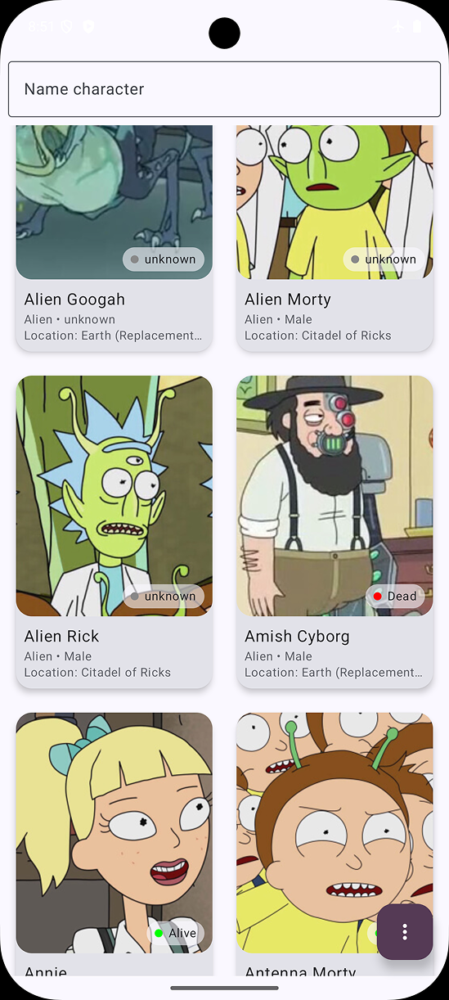
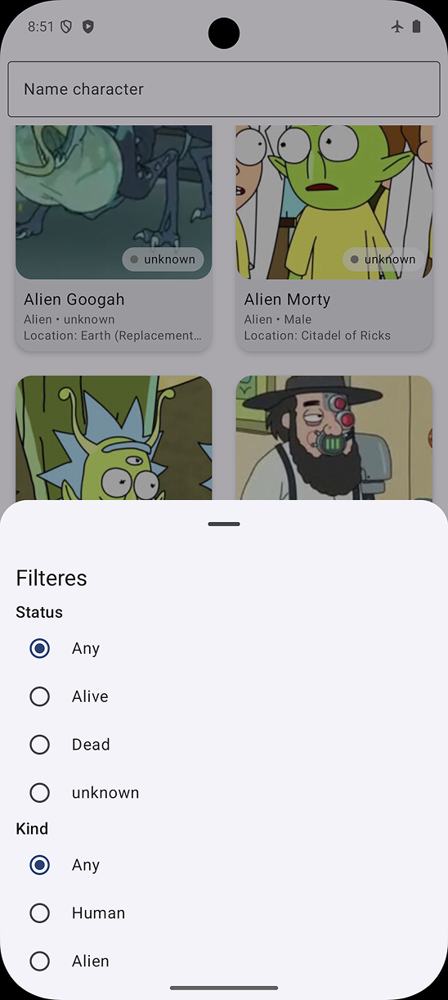
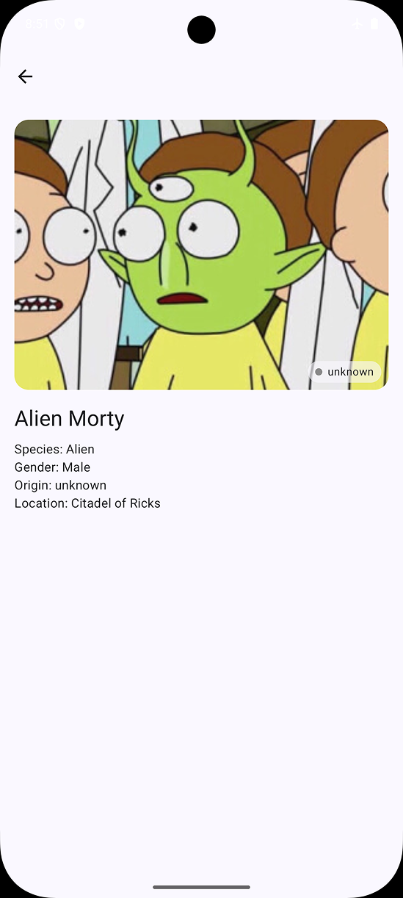

# MortyDex 🧪

MortyDex — Android-приложение на Jetpack Compose, которое позволяет просматривать персонажей из
вселенной *Rick and Morty*. Поддерживает оффлайн-доступ, фильтрацию, анимации и детальный просмотр
каждого персонажа.

## 📱 Скриншоты



## ✨ Возможности

- Загрузка списка персонажей с сервера [Rick and Morty API](https://rickandmortyapi.com/)
- Постраничная подгрузка (Pagination) с `Paging 3`
- Кеширование данных в локальную базу данных через `Room`
- Медиатор `RemoteMediator` для синхронизации сети и кэша
- Поддержка Pull-to-Refresh
- Отображение статуса персонажа (жив, мертв, неизвестно)
- Анимированные карточки персонажей с эффектом при клике
- Переход к детальному экрану персонажа
- Навигация между экранами с помощью Jetpack Navigation
- Адаптивный UI на Jetpack Compose
- Индикация пустого состояния при отсутствии результатов
- Фильтрация по параметрам с помощью `ModalBottomSheet`
- Внедрение зависимостей через `Koin`

## 🧱 Архитектура

Проект реализован по **чистой архитектуре** (Clean Architecture):

app/
├── presentation/ // UI: Compose, ViewModel
├── domain/ // UseCase, Repository interface, модели
├── data/ // Репозитории, DTO, Room, Retrofit, Paging
├── core/ // Общие утилиты, конфигурации

## 🔧 Технологии

- **Jetpack Compose** — UI
- **Kotlin**
- **Paging 3** — подгрузка и кэширование
- **Room** — локальное хранилище
- **Retrofit + OkHttp** — работа с API
- **Koin** — DI
- **Coil** — загрузка изображений
- **Material 3** — стилизация и компоненты
- **StateFlow** — управление состоянием
- **Navigation Compose** — маршрутизация экранов

## ⚙️ Сборка

1. Клонируйте репозиторий:
    ```bash
    git clone https://github.com/your-username/mortydex.git
    cd mortydex
    ```

2. Откройте в Android Studio Arctic Fox или новее.

3. Запустите на устройстве или эмуляторе.

## 📁 Структура

- `CharactersScreen.kt` — главный экран со списком
- `CharacterItem.kt` — карточка персонажа с анимацией
- `CharacterDetailsScreen.kt` — экран с подробной информацией
- `AppNavGraph.kt` — навигация по экрану
- `CharactersViewModel` и `CharacterDetailsViewModel` — логика экрана

## 💡 Идеи для будущих улучшений

- Поиск по имени
- Фильтры по эпизодам, локации, виду
- Темная тема
- Сохранение избранных

---

© 2025 MortyDex — сделано с любовью к Compose и Rick & Morty 🚀

